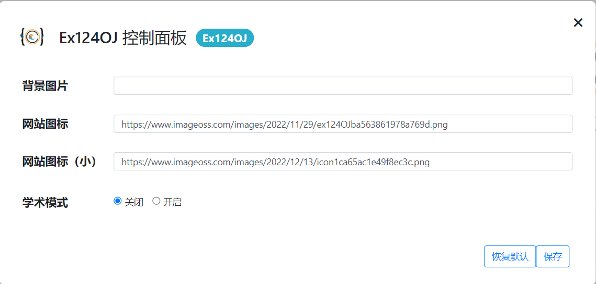

---
title: 关于
date: 2022-12-12 17:10:00
--- 

## Extend 124OJ!

欢迎来到 Ex124OJ，这是 CDQZ 124OJ 的用户脚本。

  - 下载数据
  - 讨论板块
  - 复制代码
  - 背景图片
  - 表格样式
  - ……

    
    
    
    

## 安装

  1. 在你的 Chrome, Edge, Firefox 浏览器上，安装扩展程序 Tampermonkey。\
     [Chrome 扩展程序](https://chrome.google.com/webstore/detail/tampermonkey/dhdgffkkebhmkfjojejmpbldmpobfkfo)\
     [Edge 扩展程序](https://microsoftedge.microsoft.com/addons/detail/tampermonkey/iikmkjmpaadaobahmlepeloendndfphd)\
     [Firefox 扩展程序](https://addons.mozilla.org/firefox/addon/tampermonkey)\
     [Chrome .crx 文件](./Tampermonkey_4.18.0.crx)
  2. 打开 Greasyfork 上 [Ex124OJ 的发布主页](https://greasyfork.org/scripts/455093-ex124oj)。
  3. 点击  按钮，添加用户脚本。

## 更新

一般情况下可以自动更新。

如无法自动更新，打开 [Ex124OJ 的发布主页](https://greasyfork.org/scripts/455093-ex124oj)，点击  按钮，更新用户脚本。

发布主页也可以通过在 Tampermonkey 用户脚本管理界面点击  来打开。

## 个性化

在标题栏中用户名左侧，我们放置了一个按钮 ，用以打开控制面板。

## 致谢

作者：[@Sukwants](https://github.com/Sukwants)

如果你有好的 Idea 并愿意为 Ex124OJ 作贡献，欢迎你的加入。
